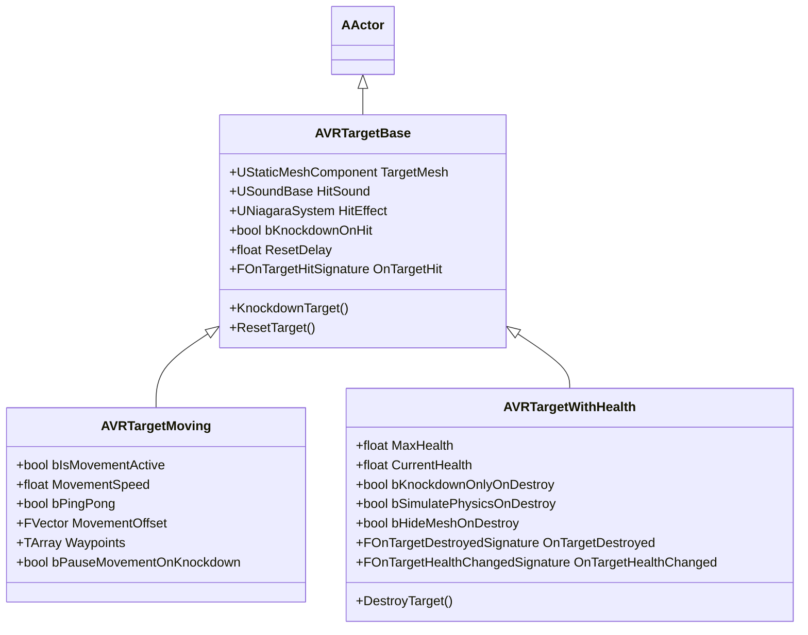

---
tags:
  - unreal-engine
  - vr-weapon-system
  - cpp
  - documentation
---

# VR Target System Documentation

The VR Target System provides interactive targets for testing modular weapons. The system consists of three C++ classes implemented in the `VRModularWeaponSystem` plugin:
1. **`AVRTargetBase`**: Swing-down/knockdown target.
2. **`AVRTargetMoving`**: Translating target that can move along a relative vector or waypoints.
3. **`AVRTargetWithHealth`**: Health-pool target with physics simulation, destruction effects, and reset logic.

---

## Class Hierarchy

---

## Detail Breakdown

### 1. Base Target (`AVRTargetBase`)
The base target class implements the core collision, hit, and knockdown mechanics:
- **Damage Framework**: Overrides `TakeDamage()` to process standard Unreal Point/Radial damage.
- **Visuals & Sounds**: Spawns a custom Niagara effect and plays a sound at the impact point using the hit normal.
- **Knockdown Animation**: When hit, it deactivates collision and smoothly interpolates the relative rotation of the `TargetMesh` backwards (using `FMath::RInterpTo` in `Tick`).
- **Resetting**: After `ResetDelay`, it schedules a reset to rotate the target back up and reactivate collision.

### 2. Moving Target (`AVRTargetMoving`)
Adds translation movement to the target actor:
- **Waypoints**: Resolves local-space waypoints to world coordinates at `BeginPlay`. If none are defined, it automatically creates a path from its starting position to `Start + MovementOffset`.
- **Movement Modes**: Supports ping-ponging (reversing direction at the ends) and looping.
- **Knockdown Interaction**: If `bPauseMovementOnKnockdown` is enabled, the target stops translating while it is knocked down, resuming only after it stands back up.

### 3. Health Targets (`AVRTargetWithHealth`)
Maintains a health pool and handles destruction states:
- **Hit Feedback**: If `bKnockdownOnlyOnDestroy` is true, the target stands firm on normal hits, only falling once health is depleted.
- **Destruction Modes**:
  1. **Simulate Physics**: On death, the mesh detaches/simulates physics, enabling gravity and applying a customizable forward impulse from the impact direction to send the target tumbling off its stand.
  2. **Hide Mesh**: Hides the mesh on death (ideal when spawning custom destructible/fractured meshes or explosion particles).
  3. **Standard Knockdown**: Swings down like a normal target.
- **Reset Logic**: Automatically stops physics simulation, restores initial transforms, resets health, and stands the target back up after `ResetDelay`.

---

## Properties & Configuration Reference

### Base Target Configurations
- `bKnockdownOnHit` (bool): Toggles swing-down behavior.
- `KnockdownAngle` (float): Target tilt angle (default `90.f`).
- `KnockdownSpeed` (float): Speed of the knockdown/reset interpolation (default `8.f`).
- `ResetDelay` (float): Time before target resets (default `3.f`).

### Movement Configurations
- `bIsMovementActive` (bool): Starts/stops movement.
- `MovementSpeed` (float): Velocity in cm/s.
- `bPingPong` (bool): If true, traverses path back-and-forth. Otherwise loops.
- `MovementOffset` (FVector): Offset destination relative to spawn.
- `Waypoints` (TArray<FVector>): Custom local-space offsets.

### Health Configurations
- `MaxHealth` (float): Maximum health pool (default `100.f`).
- `bKnockdownOnlyOnDestroy` (bool): Restricts knockdown behavior to when health reaches 0.
- `bSimulatePhysicsOnDestroy` (bool): Drops/tumbles mesh on death.
- `bHideMeshOnDestroy` (bool): Hides mesh on death.

---

## Blueprint Implementation Quickstart

1. **Create Subclass**: In the Content Browser, right-click, select **Create Blueprint Class**, search for `VRTargetBase`, `VRTargetMoving`, or `VRTargetWithHealth`, and select it.
2. **Assign Visuals**: Set the **TargetMesh** component to your desired static mesh.
3. **Assign Audio/Visuals**: Set `HitSound`, `HitEffect` (Niagara), and (for health targets) `DestroySound` and `DestroyEffect` in the details panel.
4. **Hook into Events**: Open the Blueprint Event Graph to listen to:
   - `OnTargetHit` (Base): Display damage numbers, trigger custom reactions.
   - `OnTargetHealthChanged` (Health): Update 3D floating health bar widgets.
   - `OnTargetDestroyed` (Health): Trigger score systems or gameplay milestones.
